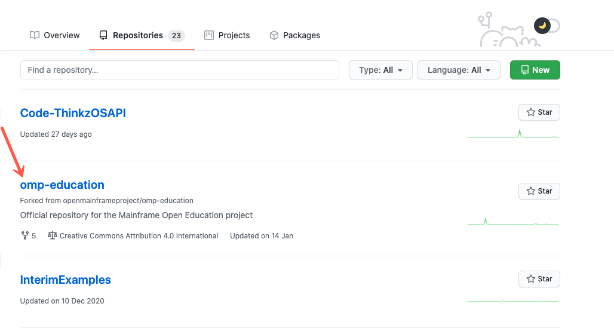

# Mainframe Open Education Project


## Discussion

You can connect with the community in a variety of ways...

- [Mailing List](https://lists.openmainframeproject.org/g/omp-education-discussion)
- [#omp-education channel on Open Mainframe Project Slack](https://slack.openmainframeproject.org)

## Governance
Mainframe Open Education is a project hosted by the [Open Mainframe Project](https://openmainframeproject.org). This project has established it's own processes for managing day-to-day processes in the project at [GOVERNANCE.md](GOVERNANCE.md).

## Contributing to this repository

###Pre-requisites:
* GitHub account: [https://github.com/join](https://github.com/join)

One of the following: 

* Git commandline: [https://git-scm.com/book/en/v2/Getting-Started-Installing-Git](https://git-scm.com/book/en/v2/Getting-Started-Installing-Git)
* GitHub Desktop: [https://desktop.github.com/](https://desktop.github.com/)

###Steps to Fork and Clone repository:
1. You've made it to the GitHub repository! Find and **select** the `Fork` button at the top. This will allow you to create your own copy of the MOE repository to save your work in. _Note:_ You will need to be signed in to GitHub to complete these steps.

2. From the pop-up, **select** your repository (you might only have one).

3. In the upper right corner, find the icon for your account. **Select** the arrow and **select** `Your repositories`. This will take you to a list of your repositories on GitHub including the MOE fork you just made.  

4. In your list of repositories, **find and select** `omp-education`.  

5. Make a clone of your copy of omp-education using Git commandline or GitHub Desktop. 
	
a. Follow the direction here for using GitHub Desktop: [https://docs.github.com/en/desktop/contributing-and-collaborating-using-github-desktop/cloning-a-repository-from-github-to-github-desktop](https://docs.github.com/en/desktop/contributing-and-collaborating-using-github-desktop/cloning-a-repository-from-github-to-github-desktop)
	
b. Using Git commandline, follow these steps:
		
	1. Under the `code` button in your repository, **select** the copy button next to the URL. 
	2. Open a terminal on your local machine.
	3. In the terminal, enter `git clone` and paste in the URL you copied from your repository. It should look like: 
	```
	➜  ~ git clone https://github.com/SweetJenn23/omp-education.git
	Cloning into 'omp-education'...
	remote: Enumerating objects: 72, done.
	remote: Counting objects: 100% (72/72), done.
	remote: Compressing objects: 100% (55/55), done.
	remote: Total 72 (delta 19), reused 36 (delta 5), pack-reused 0
	Receiving objects: 100% (72/72), 19.58 KiB | 3.26 MiB/s, done.
	Resolving deltas: 100% (19/19), done.
	```
	
Congratulations! You now have a local copy and your own repository to work in and save your changes to. When you are ready to commit your changes, continue to the next section.

### Submit a pull request to commit changes.

1. Push your changes to your local repository. You can do this with Git commandline or with GitHub Desktop.
	a. Using GitHub Desktop, follow steps `2. Selecting changes to include in a commit` and `4. Write a commit message and push your changes`: [https://docs.github.com/en/desktop/contributing-and-collaborating-using-github-desktop/committing-and-reviewing-changes-to-your-project#2-selecting-changes-to-include-in-a-commit	
](https://docs.github.com/en/desktop/contributing-and-collaborating-using-github-desktop/committing-and-reviewing-changes-to-your-project#2-selecting-changes-to-include-in-a-commit)
	b. Using Git commandline, you'll need to use the `git add`, `git commit` and `git push` commands. Examples on how these commands can be used can be found here: [https://docs.gitlab.com/ee/gitlab-basics/start-using-git.html#add-and-commit-local-changes](https://docs.gitlab.com/ee/gitlab-basics/start-using-git.html#add-and-commit-local-changes)	

2. 