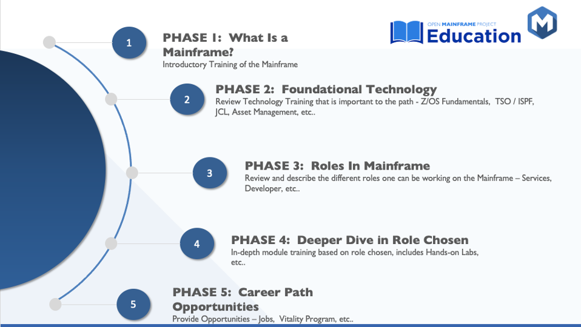

# Welcome: Learn & Contribute to MOE

[Mainframe Open Education (MOE)](https://www.openmainframeproject.org/projects/mainframeopeneducation) is sponsored by the [Open Mainframe Project ](https://openmainframeproject.org/)[(OMP)](https://openmainframeproject.org/). The community partnership focuses on ‘open sourcing’ mainframe learning roadmaps and community knowledge transfer.&#x20;

### Why?&#x20;

To make it easier for hiring managers to have access to a plan and co-develop valuable assets – much of it in the minds and archives of our respective organizations. The vision of this project is a place for mainframe experts to share and consume the tribal knowledge they gained with years of experience. MOE board of experts will promote submissions within quality standards for the end user - all are cataloged in a consumable roadmap orientation. There are thousands of experts in the market to pass knowledge to the next generation. Join the project to learn about this community partnership and how to participate and contribute.


Mainframe Open Education 3-Minute Overview


### **Mission**

The MOE mission is to offer all mainframe users a platform to cultivate skill onboarding that is most critical to future hires and to allow for knowledge sharing and community contribution. We seek to align the best-of-breed foundational curriculum to cultivate new mainframe skills for today's hybrid data center. Specifically, MOE can help with the following aspects:

* Mainframe eco-system collaboration is designed to support companies as they onboard **new mainframe talent.**
* Create a community through **shared ownership** and a shared platform via the Open Mainframe Project.
* Encourage market contributions of **education** assets
* Ease the Path to obtaining industry-**relevant mainframe skills**
* **Develop learning** roadmaps for job roles on the mainframe
* Provide business leaders easy access to **free foundational education**
* Address the **faculty & university awareness gaps** with new access to learning curriculum

### Content Phases

The project was designed based on five initial phases. Our goal is to ensure we have the most relevant information organized in a logical and accessible way for the community. This structure is a starting point where the [personas](welcome-learn-and-contribute-to-moe/who-can-contribute.md) can contribute and collaborate to develop and continuously improve the content library.&#x20;

For more information about project phases, see more details in the image below.

<figure><figcaption>
Five content phases of MOE
</figcaption></figure>

### Join MOE community on Slack:&#x20;


Connect with other users and developers on Slack #omp-education-project - [**JOIN US**](https://slack.openmainframeproject.org/)&#x20;

